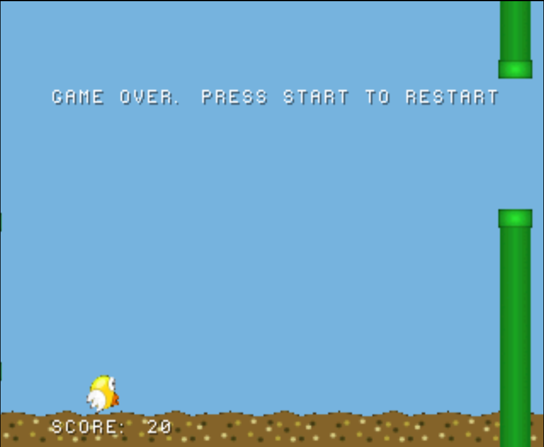

# psx-flappy-bird
Flappy bird style game for PS1

## Building
Requirements:
- PSn00bSDK
- LICENSA.DAT placed license file in the `/build` directory (or comment out the license line in `iso.xml`)

`cmake --preset default .` will setup the build directory
`cmake --build ./build` will build the game

Upon successful build, the disc image will be `./build/template.cue` and `./build/template.bin`.
